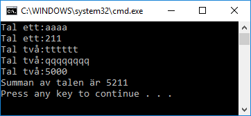
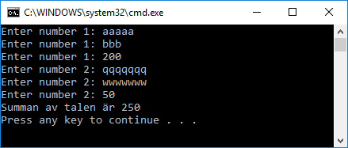
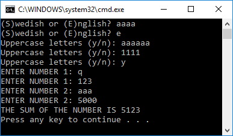

# Addera tal

## 01

Skapa en console-app som frågar användaren efter två tal och skriver ut summan av talen:

Lös problemet på enklast möjligast sätt. Bry dig inte om validering. Lägg allt i en metod.

## 02

Modifiera programmet genom att skapa två metoder: *AskForNumber* och *DisplaySum*. Ditt huvudprogram ska se ut såhär:

    int a = AskForNumber();
    int b = AskForNumber();
    int sum = a + b;
    DisplaySum(sum);

Programmet ska funka likadant som innan.

## 03

Justera *AskForNumber* så du bara accepterar heltal som indata:

## 04

Justera *AskForNumber* så metoden tar en parameter som anger vilket tal som ska matas in.

    int a = AskForNumber("Tal ett:");
    int b = AskForNumber("Tal två:");
    int sum = a + b;
    DisplaySum(sum);

Koden ovan ska funka på följande sätt:

## 05

Justera *AskForNumber* och *DisplaySum* så det går att välja språk, antingen *swedish* eller *english*.

*AskForNumber* ska också ta en parameter som anger vilken siffra som ska anges.

Denna kod...

    int a = AskForNumber(1, "english");
    int b = AskForNumber(2, "english");
    int sum = a + b;
    DisplaySum(sum, "swedish");

...ska funka såhär:

## 06

Justera *AskForNumber* så det går att ange om texten ska vara i stora eller små bokstäver:

Denna kod...

    int a = AskForNumber(1, "swedish", true);
    int b = AskForNumber(2, "english", false);
    int sum = a + b;
    DisplaySum(sum, "swedish", true);

...ska funka såhär:

## 07

Lägg till en metod *AskForLanguage* som returnerar "swedish" eller "english"

Denna kod...

    string language = AskForLanguage();
    int a = AskForNumber(1, language, true);
    int b = AskForNumber(2, language, true);
    int sum = a + b;
    DisplaySum(sum, language, true);

...ska funka såhär:

## 08

Lägg till en metod *AskForUppercaseOrNot* som ska returnera true eller false.

Denna kod...

    string language = AskForLanguage();
    bool upperCase = AskForUppercaseOrNot(language);
    int a = AskForNumber(1, language, upperCase);
    int b = AskForNumber(2, language, upperCase);
    int sum = a + b;
    DisplaySum(sum, language, upperCase);

...ska funka såhär:

## 09

Skapa en *enum* som du döper till *Language*

Modifiera *AskForLanguage* så metoden returnerar ett *Language* istället för en sträng:

    Language language = AskForLanguage();
    bool upperCase = AskForUppercaseOrNot(language);
    int a = AskForNumber(1, language, upperCase);
    int b = AskForNumber(2, language, upperCase);
    int sum = a + b;
    DisplaySum(sum, language, upperCase);

Tips: du behöver modifiera flera metoder för att det ska funka

# Dödsuppgifter 🐼🐼🐼

Mycket svåra uppgifter...

## 10

Lägg till möjligheten att översätta texter till olika språk.

Skapa en klass *Translator* som används för att översätta texter. Använd den som ett fält i ditt program.

    static Translator translator;

Ditt huvudprogram ska nu se ut såhär:

    Language language = AskForLanguage();
    translator = new Translator(language);
    bool upperCase = AskForUppercaseOrNot();
    int a = AskForNumber(1, upperCase);
    int b = AskForNumber(2, upperCase);
    int sum = a + b;
    DisplaySum(sum, upperCase);

Skapa metoden *Get* och enumen *TextCode* och skriv t.ex metoden *AskForUppercaseOrNot* på följande sätt:

    private static bool AskForUppercaseOrNot()
    {
        while (true)
        {
            Console.Write(translator.Get(TextCode.BigLettersYesNo) + ": ");
            string answer = Console.ReadLine()?.ToUpper();
            if (answer == translator.Get(TextCode.YesInOneCharacter))
                return true;
            if (answer == translator.Get(TextCode.NoInOneCharacter))
                return false;
        }
    }

## 11

Skapa en språkfil *languagefile.txt* som innehåller:

    BigLettersYesNo;Stora bokstäver (j/n);Uppercase letters (y/n)
    YesInOneCharacter;J;Y
    NoInOneCharacter;N;N
    EnterNumber;Ange tal {0};Enter number {0}
    TheSumOfTheNumberIs;Summan av talen är {0};The sum of the number is {0}

...och låt *Translator* läsa in denna fil varje gång programmet körs

## 12

(Mycket svår)

Skapa tester för att verifiera att ditt program fungerar i olika scenarion.

(Du behöver modifiera koden och skapa fler klasser för att få det att funka)

Här är ett exempel på ett test där användaren väljer svenska som språk, nej för uppercase och sedan matar in "xxx", "100", "yyy", "zzz", "200". Programmet svara sedan med att summan är 300.

    [TestMethod]
    public void swedish_nej_xxx_100_yyy_zzz_200()
    {

        // Arrange

        var translator = new Translator(Language.Swedish);

        var console = new ConsoleWrapper
        {
            LinesToRead = new List<string>
            {
                "s","n", "xxx", "100", "yyy", "zzz", "200"
            }
        };

        var app = new App(console, translator);

        // Act

        app.Run();

        // Assert

        var expected = new List<string>
        {
            translator.Get(TextCode.SwedishOrEnglish),
            translator.Get(TextCode.BigLettersYesNo),
            translator.Get(TextCode.EnterNumber, 1),
            translator.Get(TextCode.EnterNumber, 1),
            translator.Get(TextCode.EnterNumber, 2),
            translator.Get(TextCode.EnterNumber, 2),
            translator.Get(TextCode.EnterNumber, 2),
            translator.Get(TextCode.TheSumOfTheNumberIs, 300)+'\n',
        };
        CollectionAssert.AreEqual(expected, console.Output);

    }