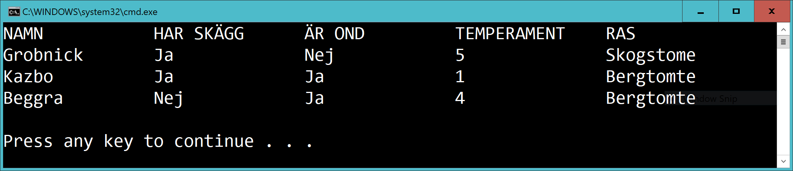

# Checkpoint - Tomtar

## Intro

Lämna in en **zip** av hela din solution. Lägg även med ett script **create-and-insert.sql** som skapar databasen GnomeDb och lägger in tre tomtar med tillhörande info.

## Level 1

Skapa en databas **GnomeDb** med en tabell **Gnome**

Lägg in tre tomtar i gnome-tabellen. Varje tomte ska ha ett namn.

Gör en console-app som skriver ut namnen på alla tomtar.

Använd denna connectionsträng:

	string conString = "Server = (localdb)\\mssqllocaldb; Database = GnomeDb;"

Ditt *Main*-metod **ska** se ut såhär:

    var dataAccess = new DataAccess();
    List<string> gnomes = dataAccess.GetGnomesFromDatabase();
    DisplayGnomes(gnomes);

Du behöver alltså skapa klassen **DataAccess**. Använd inte *Console.Write* i DataAccess-klassen.

Exempel:

## Level 2

Uppdatera gnome-tabellen enligt nedan.

Varje tomte:
- har ett namn
- har skägg eller är skägglösa 
- är ond eller god 
- har ett temperament (ett heltal)
- tillhör en ras (t.ex skogstomte, bergstomte, kaostomte)

Använd lämpliga datatyper.

Skriv ut info om alla tomtar:

Obs att "har skägg" och "är ond" ska skrivas ut som "Ja" eller "Nej".

Lägg till en lämplig tabell och relation. 

Ditt huvudprogram **ska** se ut såhär:

    var dataAccess = new DataAccess();
    List<Gnome> gnomes = dataAccess.GetGnomesFromDatabase();
    DisplayGnomes(gnomes);

Du behöver alltså skapa klasserna **DataAccess** och **Gnome**.
