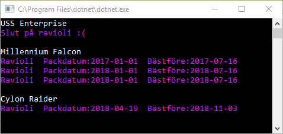

# Checkpoint - Rymdskepp

## Intro

Du ska skriva en app som sparar och hämtar rymdskepp.

Lös denna uppgift med **Entity Framework Core**

När du lämnar in så skapa en metod som återskapar databasen: 

    private void RecreateDatabase()
    {
        using (var context = new SpaceContext())
        {
            context.Database.EnsureDeleted();
            context.Database.EnsureCreated();
        }
    }

Anropa denna metod när ditt program startar.

För att få godkänt ska det räcka med att starta programmet från en annan dator. Tips: testa detta genom att ta bort din databas och sedan köra programmet. 

## Level 1

Gör en metod **AddSpaceship** som lägger till ett rymdskepp i databasen.

Skriv dessutom metoderna **GetAllSpaceships** och **DisplaySpaceships**

Så här **ska** ditt huvudprogram se ut:

    RecreateDatabase();
            
    AddSpaceship("USS Enterprise");
    AddSpaceship("Millennium Falcon");
    AddSpaceship("Cylon Raider");

    List<Spaceship> list = GetAllSpaceships();
    DisplaySpaceships(list);

...och det ska ge följande resultat:

## Level 2

För att kunna flyga långt i rymden krävs ett lager med ravioli. 

All ravioli har ett packdatum och ett bästföredatum. Bästföredatumet är alltid 6 månader och 15 dagar senare än packdatumet.

Skriv en metod **AddRavioliForSpaceship** som förväntar sig namn på ett rymdskepp och ett antal ravioliburkar samt deras packdatum. Om det finns ett rymdskepp med detta namn så läggs burkarna i skeppet. Annars sker ingenting.

Så här **ska** ditt huvudprogram se ut:

    RecreateDatabase();
            
    AddSpaceship("USS Enterprise");
    AddSpaceship("Millennium Falcon");
    AddSpaceship("Cylon Raider");

    AddRavioliForSpaceship("Cylon Raider", 1, "2018-04-19");
    AddRavioliForSpaceship("Millennium Falcon", 1, "2017-01-01");
    AddRavioliForSpaceship("Millennium Falcon", 2, "2018-01-01");
    AddRavioliForSpaceship("Nalle Puh", 99, "1950-01-01");

    List<Spaceship> list = GetAllSpaceships();
    DisplaySpaceships(list);

...och det ska ge följande resultat:

