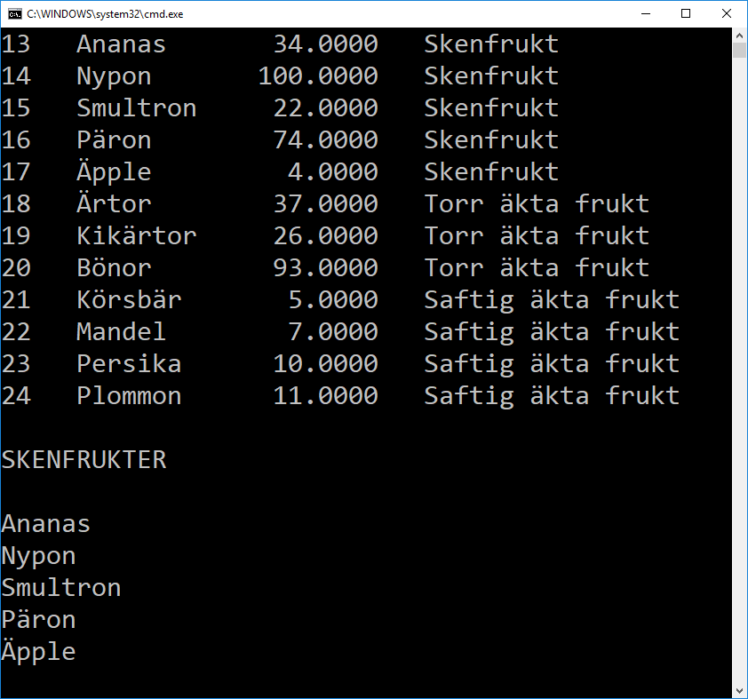

# Uppgift

Skapa en main-metod:

    static void Main()
    {
        ClearAndInitDatabase();
        DisplayAllFruits();
        DisplayJustSkenfrukter();
    }

Programmet ska 
- Rensa databasen och lägg in några frukter kopplade till fruktkategorier
    - Skenfrukt
    - Torr äkta frukt
    - Saftig äkta frukt
    
- Visa alla frukter
  - Id
  - Namn
  - Pris
  - Kategori

- Visa namn på de frukter som är *skenfrukter*

Såhär ska output från programmet se ut:

# Tips

## Nuget

Installa dessa paket:

    Microsoft.EntityFrameWorkCore
    Microsoft.EntityFrameWorkCore.SqlServer     (krävs för UseSqlServer)
    Microsoft.EntityFrameWorkCore.Tools         (krävs för att kunna göra migrations)

## FruitContext

Skapa en fil FruitContext.cs med detta innehåll:

    public class FruitContext : DbContext
    {
        public DbSet<Fruit> Fruits { get; set; }
        public DbSet<FruitCategory> FruitCategories { get; set; }

        protected override void OnConfiguring(DbContextOptionsBuilder optionsBuilder)
        {

            if (!optionsBuilder.IsConfigured)
            {
                optionsBuilder.UseSqlServer("Server = (localdb)\\mssqllocaldb; Database = DemoWithOneProject2;");
            }
            
        }
    }

## DataAccess.cs

Skapa en fil DataAccess.cs med detta innehåll:

    public class DataAccess
    {
        private FruitContext _context;

        public DataAccess()
        {
            _context = new FruitContext();
        }
        
        public void SaveChanges()
        {
            _context.SaveChanges();
        }

    }

## ClearDatabase

Gå igenom t.ex alla frukter med *foreach* och ta bort en frukt i taget.

Detta ger alla frukter:

    _context.Fruits

För att ta bort en frukt

    _context.Remove(...)

## AddCategoriesAndFruits

Skapa ett objekt t.ex FruitCategory

    var skenfrukt = new FruitCategory  ....

Lägg till en kategori i context

    _context.FruitCategories.Add(....)

## GetAll

Testa
   
    _context.Fruits

Använd *Include* om du får NullException

    _context.Fruits.Include(x=>....)

## GetFruitsInCategory

Använd *Include* om du får Nullexception
