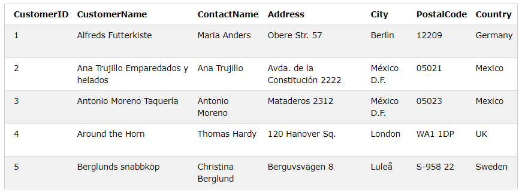

## Diskussion

- Vad är en databas?
- Varför behövs databaser?
- Varför inte bara spara i en textfil?

## Vad är SQL?

SQL är ett standardiserat dataprogramspråk för att spara, förändra och hämta data i databaser

SQL står för Structured Query Language

SQL är det standardiserade sättet att kommunicera med en relationsdatabas 

## Historik

1970 Dr. Edgar F. "Ted" Codd från IBM kom på konceptet kring relationsdatabaser

1974 SQL utvecklades av forskare från IBM (Chamberlin och Raymond Boyce)

1986 IBM tog fram den första prototypen för en relationsdatabas. SQL blev en ANSI-standard 1986. Den första relationsdatabasen togs fram av *Relational Software* som senare blev *Oracle*.

1987 SQL blev ISO-standard 

## SQL Server historik

1989: SQL Server 1.0 släpps för OS/2

2000: SQL Server 2000.

2005: SQL Server 2005 

2008: SQL Server 2008

2010: Azure SQL database

2012: SQL Server 2012

2014: SQL Server 2014

2016: SQL Server 2016

2017: SQL Server 2017

## Vad kan SQL göra?

Med SQL kan du:
- Hämta data från en databas
- Lägga in data
- Modifiera data
- Ta bort data

Även:
- Skapa nya databaser
- Skapa nya tabeller (och modifiera)
- Skapa stored procedures
- Skapa vyer
- Sätta behörighet

## En standard

SQL är en standard men det finns vissa skillnader hur man skriver kommandon mellan olika databaser

Exempel på olika relationsdatabaser:
- SQL Server
- MySQL
- Oracle
- Sybase
- PostgreSQL

## Relationsdatabaser

En tabell är en samling av relaterad data. Den består av kolumner och rader. T.ex ett kundregister.

Exempel på en tabell:

En tabell är det sättet du lagrar information i en databas. 

Varje tabell är uppdelad i fält. Fälten i kundtabellen ovan är: CustomerID, CustomerName, ContactName, Address, City, PostalCode and Country. 

En **record** är samma sak som en **rad** i en tabell.

## SQL Statements

Det mesta du behöver göra med en databas utförs med SQL-kommandon.

Här är ett exempel på ett SQL-kommando som hämtar alla rader i Customers-tabellen:

    SELECT * from Customers

Ett exempel till som bara hämtar två kolumner:

    SELECT CustomerName, City 
    FROM Customers;

Hämta bara de rader där kunden bor i Mexico:

    SELECT * FROM Customers
    WHERE Country='Mexico';

Hämta de kunder som inte bor i varken Tyskland eller USA:

    SELECT * FROM Customers
    WHERE NOT Country='Germany' AND NOT Country='USA';

Sortera kunderna utifrån land. Därefter utifrån namn.

    SELECT * FROM Customers
    ORDER BY Country, CustomerName;

Det finns även kommandon för att lägga till info:

    INSERT INTO Customers (CustomerName, ContactName, Address, City, PostalCode, Country)
    VALUES ('Cardinal', 'Tom B. Erichsen', 'Skagen 21', 'Stavanger', '4006', 'Norway');

... och uppdatera:

    UPDATE Customers
    SET ContactName = 'Alfred Schmidt', City= 'Frankfurt'
    WHERE CustomerID = 1;

...och ta bort:

    DELETE FROM Customers
    WHERE CustomerName='Alfreds Futterkiste';

Det går även att skapa helt nya tabeller:

    CREATE TABLE Persons (
        PersonID int,
        LastName varchar(255),
        FirstName varchar(255),
        Address varchar(255),
        City varchar(255) 
    );

----

# Övrig

## Vad är null?

Ett fält som inte har ett värde får värdet NULL 

Det är inte samma som tom sträng "" eller t.ex siffran 0.

## Vad är constraints?

Ett sätt att begränsa vilken data som får sparas i databasen.

T.ex: NOT NULL betyder att en kolumn inte får ha tomma värden

UNIQUE: säger att en kolumns värden inte får dyka upp flera gånger i samma tabell

## Varför normalisering?

Databasnormalisering är processen för att organisera data på ett effektivt sätt i en databas.

Varför?
- Tar bort redundant data (t.ex att spara samma data i mer än en tabell)
- Se till att data beroenden är vettiga

En effekt är att databasen tar mindre plats på hårddisken.

Den tredje normalformen är gott nog att komma till.

## Datatyper

I en databas kan du spara
- siffror
- strängar och tecken
- datum
- binärdata

Mer specifikt:
- Exact Numeric Data Types
- Approximate Numeric Data Types
- Date and Time Data Types
- Character Strings Data Types
- Unicode Character Strings Data Types
- Binary Data Types
