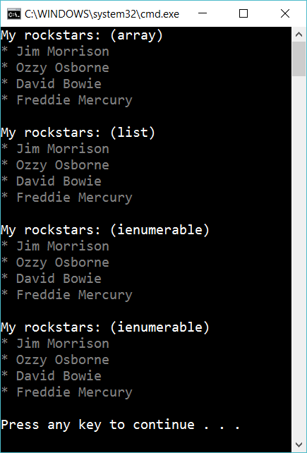

# 12.1 Array, List and IEnumerable

## Part 1

Create a list and an array of rock stars

    string[] rockstarsArray = new string[] { "Jim Morrison", "Ozzy Osborne", ... };
    List<string> rockstarsList = new List<string> { "Jim Morrison", "Ozzy Osborne", ... };

Create a method that displays an array of rock stars:

    void DisplayArrayOfRockStars(string[] rockstars)

Create another method that displays a list of rock stars:

    void DisplayListOfRockStars(List<string> rockstars)

# Part 2

Finally, create a method that expect an IEnumerable of strings. You can use this method to display the array and to display the list.

## Extra

1. What do you gain of using ienumerable in the example above?

2. Try to add one more rockstar within the three methods:

        void DisplayArrayOfRockStars(string[] rockstars)
        void DisplayListOfRockStars(List<string> rockstars)
        void DisplayListOfRockStars(IEnumerable<string> rockstars)

What happens?

3. Make a chart of what you can (and cannot) do with these different types:

	    string[]
	    List<string>
	    IEnumerable<string>

4. Create a method

	    void DisplayListOfRockStars(IEnumerable<object> rockstars)

What is the good and bad things about this method?

5. Implement this method:

	    void RemoveFirstRockStar(IEnumerable<string> rockstars)

What problems do you get?
