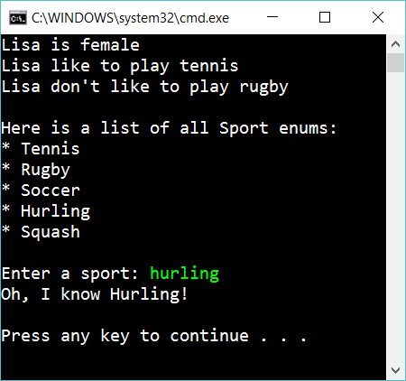

# 6.4 Enums

Create an enum *Sport* with the values: Tennis, Rugby, Soccer, Hurling, Squash

Create an enum *Gender* with the values: Female, Male, Other

Create a class *Person* with the following properties:

- FirstName
- LastName
- Birthday
- Gender
- FavoriteSport

Create an instance “lisa” of a Person and set values for firstnamn, gender etc.

Check if lisa likes rugby. 
Write a list of all sports in the enum.

Ask the user for a sport. If the user enter a sport in the Sport enum then respond positive (“Oh, I know badminton!”). Otherwise respond negative (e.g “Sorry I don’t know badminton”) 

## Extra

1. Write the list of sports in order

2. Add one more Enum and use it in the class Person

## Hint

To get all names from your enum:

    Enum.GetNames(typeof(MyEnum))

To check if a string is one of your enums:

    if (Enum.TryParse(someString, true, out MyEnum myenum))
    {
        ...
    }