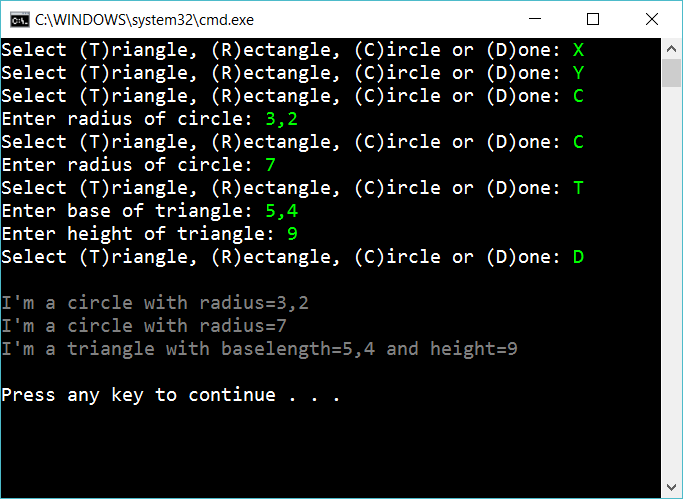

# 7.2 Build a list of shapes

Create the following console app:

The app should ask for different kind of shapes and add the shapes to a list:

    List<Shape> allShapes

When the user hit **D** the app go through allShapes and calls ToString on each.

## Extra

1. Create a method that summerize the choice of the user:

        “You selected two circles and one triangle”
        “You selected three triangles”

2. Add one more action that the user can make (besides adding a shape or quitting)

## Hint

Create different methods for "asking for shapes" and "printing shapes":

    List<Shape> shapeList = AskForListOfShapes();
    PrintAllShapes(shapeList);

Create different methods:

    private Circle AskForCircle()
    {
        ...
    }

    private Rectangle AskForRectangle()
    {
        ...
    }

    private Triangle AskForTriangle()
    {
        ...    
    }

Create a separate methods for asking for a number:

    public double AskForNumber(string question)
    {
        ...
    }