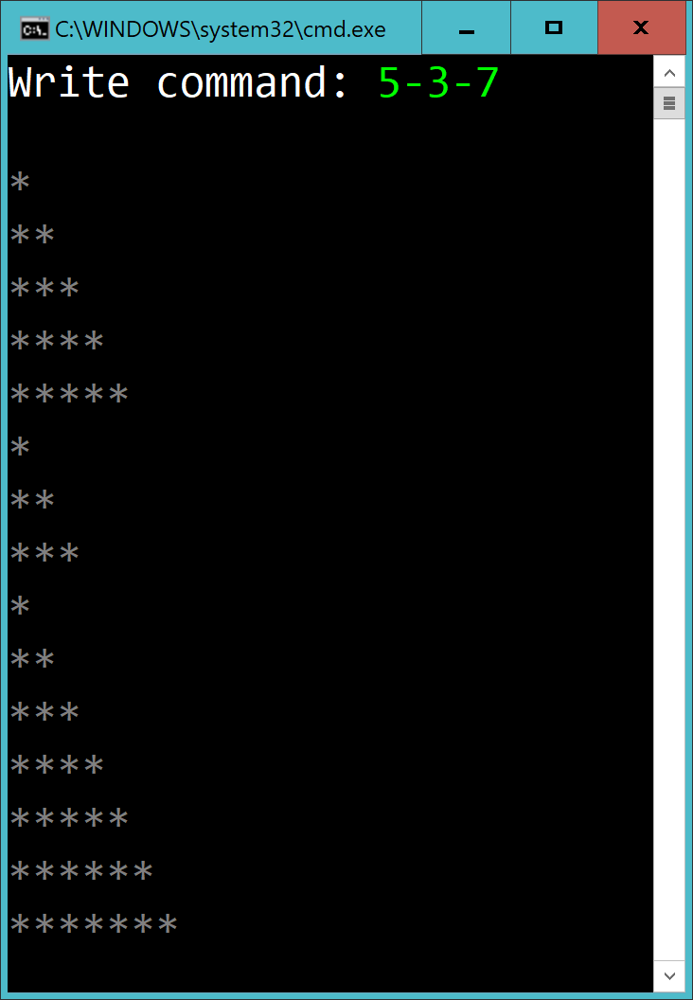
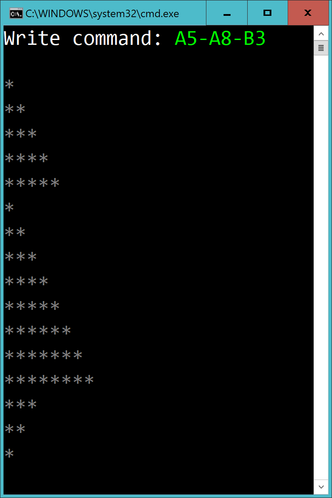

# Checkpoint - Triangles

## Intro

Create a console-app and solve Level 1 or Level 2. Just hand in one solution.

## Time

2h

## How to submit

When you're done, create a **zip** of your solution.

Remove the folders **.vs**, **bin** and **obj**.

## Level 1

The user enter a list of numbers, separated with dash. Repond by drawing some triangles. The height and base of the triangles should be the same. The triangles should be displayed below each other in order.

In the example below a triangle with size 5 is displayed, then a triangle with size 3 and finally a triangle with size 7.

## Level 2

The user should be able to display two types of triangles:

- Triangle A has one sharp corner pointing up
- Triangle B has one sharp corner pointing down

Example:

- Triangle A2 has one sharp corner pointing up with the size 2.
- Triangle B4 has one sharp corner pointing down with the size 4.

Example when running the program:

