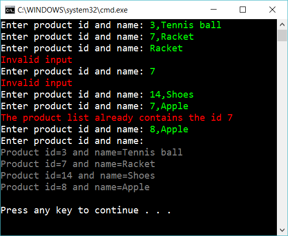

# 10.6 Add validation

Continue on the previous app, but add validation:

## Extra

1. In the example above “7,Apple” didn’t work. One other solution might be that the product with id=7 will get a new name: Apple. Ask the user first how he/she want the program to work in this situations.

2. Add a command. If the user input this string:

	    7,Apple,Command:Replace

… then product with id=7 should get the name Apple, even if the product already exist

3.  Add one more command. If the user input this string:

	    7,Apple,Command:ToUpper

...then store the name APPLE.

4. Figure out one more command and implement

5. Let the user add many commands at the same time

	    7,Apple,Command:ToUpper+Replace

## Hint

Create a method BuildProductDictionary:

    private Dictionary<int, string> BuildProductDictionary()
    {
        ...

        while (true)
        {
            ...
            // Use "break" if user just hit the key "return"
            // Use "continue" if user entered a wrong input
            ...
        }
    }