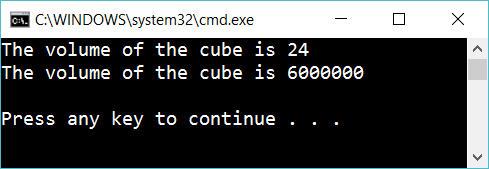
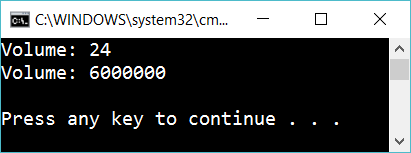

# 6.2 Create cubes

Create a class Cube that expects three values: height, width, depth. Write a method WriteVolume. The class should work this way:

    Cube mycube = new Cube(2, 3, 4);
    Cube supercube = new Cube(100, 200, 300);
    
    mycube.WriteVolume();
    supercube.WriteVolume();

…and the result should be:

## Extra

1. Create a method CalculateVolume that doesn’t write anything, but just return the volume. The class should be used in the following way:
   
        Cube mycube = new Cube(2, 3, 4);
        Cube supercube = new Cube(100, 200, 300);
    
        double volume = mycube.CalculateVolume();
        Console.WriteLine($"Volume: {volume}");
    
        double supervolume = supercube.CalculateVolume();
        Console.WriteLine($"Volume: {supervolume}");

…and give this result:

 

2.
Create a method for calculating the area of the Cube. Use it in the same way as above

3.
Create a method that changes the color of a Cube. Use it in the same way as above

4.
Figure out two more method that would be useful for a Cube. Implement the methods and use them.
