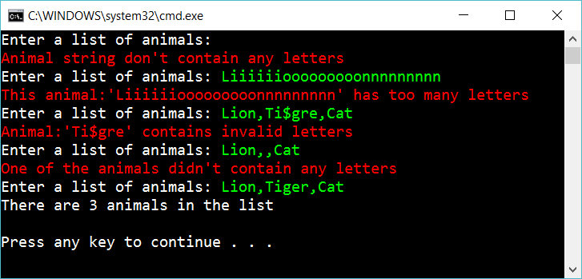

# 8.3 Animals in a list

Create the following console app:

 
The user should enter a list of animals. The app creates a list of string with the animals.

Answer with an error message if one of the following occurs:

- User don’t enter any animal
- One of the animals has more han 20 letters
- One of the animals contains an invalid characters (just accept some letters like a-z, å,ä,ö)

Solve the problem by creating **ArgumentException’s** and catch the exceptions.

## Extra

1. Figure out one more thing to check. Solve the problem.

2. Create a *testproject* with testmethods to assert that your code don't have bugs

## Hint

Create a method **ParseAnimals** that return the animals or throw an exception

    private string[] ParseAnimals(string animalsString)
    {
        ...

        throw new ArgumentException("Animal string don't contain any letters");

        ...

        return animals;
    }