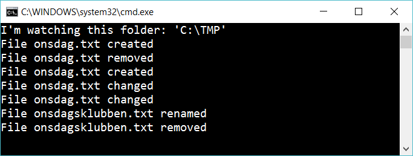

# 9.2 Watch a folder

Use *FileSystemWatcher* to listen to what happens in a folder:

 
Report if a file is created, changed or removed.

## Extra

1. If someone modifies *onsdag.txt* then update a file *statistics.txt* so it contains the size of onsdag.txt

2. I someone modifies any file in c:\TMP then create a file statistics.txt with names of all files and their size, e.g:

	    onsdag.txt 			1234bytes
	    recept.docx			15KB
	    katt.jpg			3Mb

3. (Hard!) Create a program that strips html from a textfile (removes all tags). Call this program striphtml.exe. If someone changes a html-file in C:\TMP then call striphtml.exe so it creates a plain file. 
myhomepage.html ==> myhomepage-stripped.txt

## Hint

Use a FileSystemWatcher

    var watcher = new FileSystemWatcher(); 
    watcher.Path = @"C:\TMP";
    watcher.EnableRaisingEvents = true;

Add this line to execute your method "FileChanged" when a file is changed:

    watcher.Changed += FileChanged;

